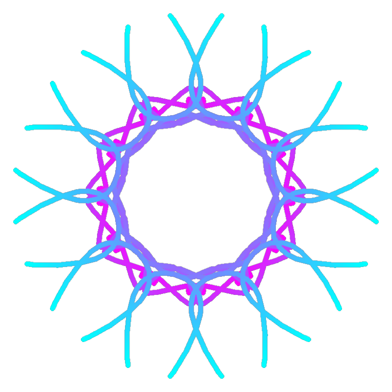

# 万花筒 (Kaleidoscope)


这是一个使用 Python 和 Pygame 构建的交互式万花筒绘图应用。用户可以通过手绘曲线、调整参数和管理图层来生成对称的艺术图案。

---

**[程序运行截图或 GIF 动图]**


---

## 功能列表

- **手绘输入**: 支持使用鼠标在画布上绘制任意曲线作为图案基础。
- **参数调整**:
  - **分片数量**: 可输入数值来改变图案的对称轴数量。
  - **对称模式**: 提供“万花筒”（旋转+镜像）和“仅旋转”两种模式。
- **笔刷系统**:
  - **笔刷类型**: 包含线条、圆点和喷枪三种笔刷。
  - **渐变颜色**: 可设置起始和结束颜色，使笔触颜色平滑过渡。
  - **笔刷大小**: 可通过滑块调整笔刷粗细。
- **图层管理**:
  - 每次生成操作会创建一个新图层。
  - 提供图层列表，支持选中并删除指定图层。
- **动态效果**:
  - 可使最终图案进行自动旋转。
  - 可使最终图案进行脉动缩放。
- **导出功能**:
  - 支持将静态画面导出为 **PNG** 图片。
  - 支持将带有动态效果的画面录制并导出为 **GIF** 动画。

## 特别说明

本项目在开发过程中结合了 AI 辅助编程。

- **项目构想与功能需求**: 由人类开发者提出。
- **代码实现与迭代**: 主要由 Google Gemini 2.5 Pro 模型根据需求生成。
- **调试与重构**: 由人类开发者与 AI 协作完成。

## 安装与运行

### 1. 环境要求

- Python 3.8 或更高版本

### 2. 安装步骤

克隆本仓库到本地：

```bash
git clone https://gitee.com/flowingr/kaleidoscope.git
```

进入项目目录，并安装依赖项：

```bash
cd Kaleidoscope-master
pip install -r requirements.txt
```

(如果 pip 命令指向了错误的环境，请使用 python -m pip install -r requirements.txt。)

### 3. 运行程序

```bash
python main.py
```

使用说明
程序界面分为三个区域：
左侧 - 绘图区: 按住鼠标左键拖动以绘制曲线。
中间 - 控制面板: 用于调整所有绘图参数和触发功能。
右侧 - 图层面板: 用于管理已生成的绘图图层。
参与贡献
如果您在使用中发现任何问题或有功能建议，欢迎通过提交 Issue 来告知我们。我们也欢迎您通过 Pull Request 来直接参与代码的改进。
开源协议
本项目基于 MIT License 发布。
